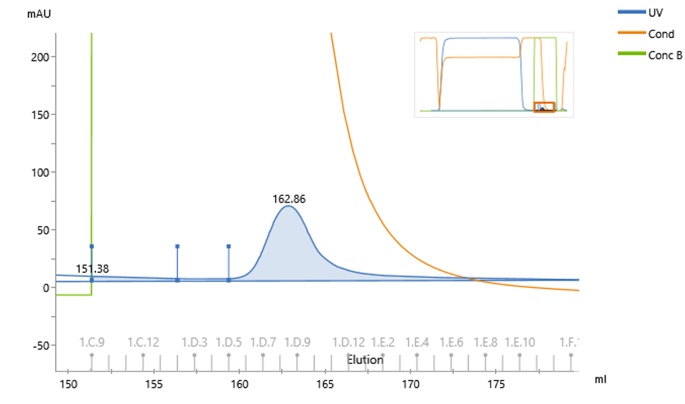
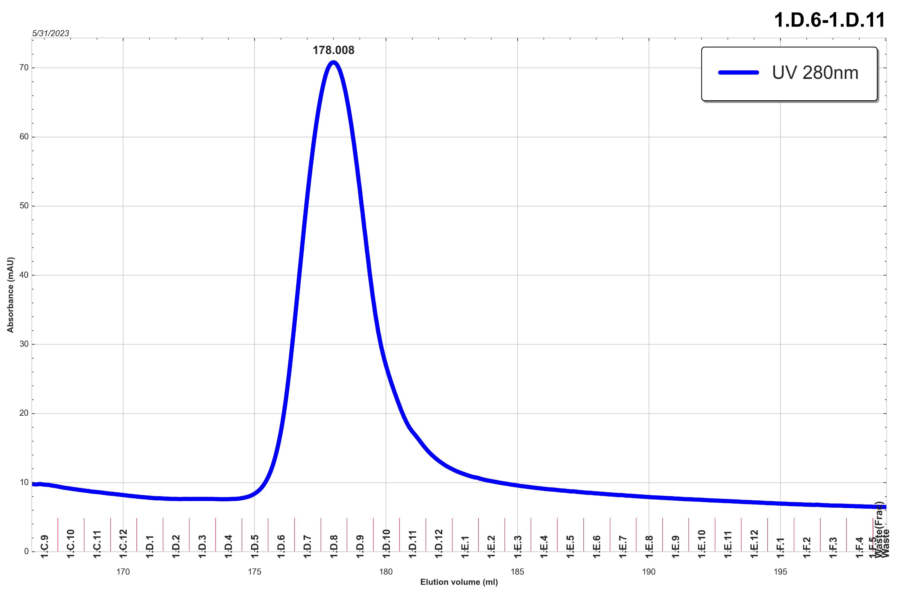
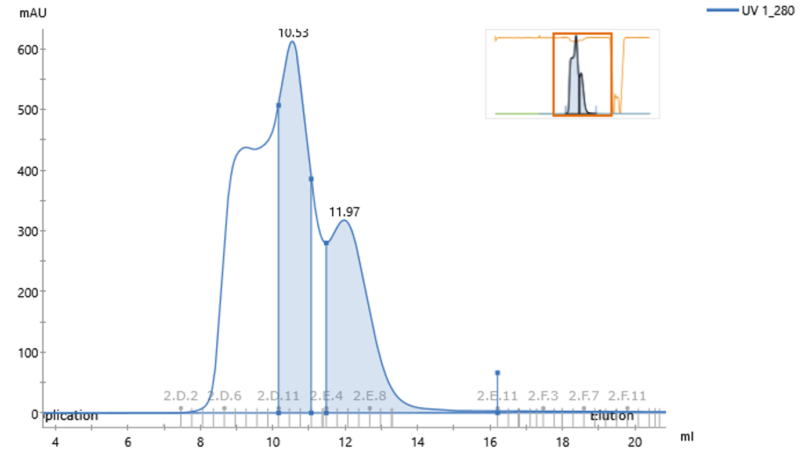
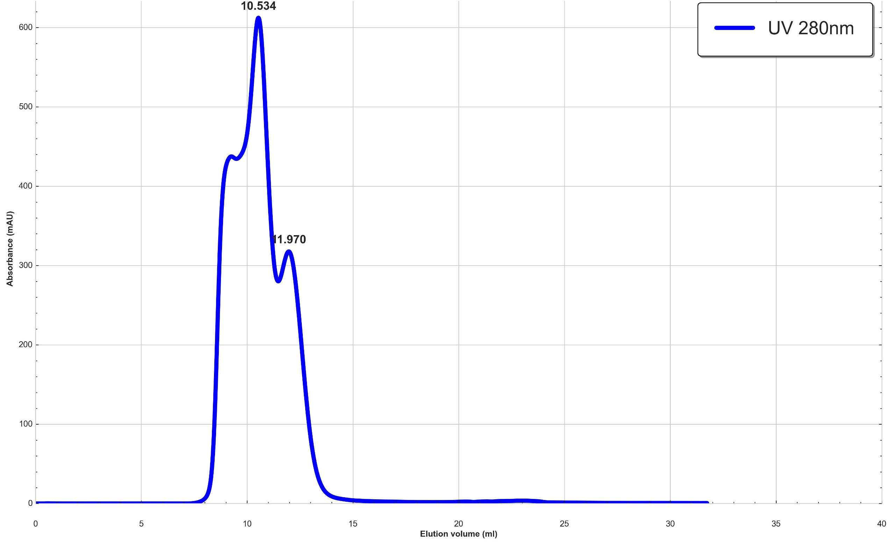

# **Project AKTAmercy - "CHROMER"**

[] |
[] |
[]

CHROMER is a Pythonic automaton that facillitates the post-processing of chromatographic data from the AKTA Pure HPLC systems running UNICORN (7.0+). It is designed to be used in conjunction with a Google Sheets database to index purification targets and their associated data. An example can be found below.

 Its current functionality is limited to the [Kulp Lab](https://wistar.org/our-scientists/daniel-kulp), but in the future it will be expanded to be more generalizable.

## Features

- **PyCORN-powered Parsing**: Parses the proprietary .UFol (*UNICORNS*) archives generated by the UNICORN Evaluation software for the chromatographic data and metadata, using the PyCORN module by [Yasar L. Ahmed](https://github.com/pyahmed) 
- **Chromatogram Recognition**: Recognizes and annotates chromatograms with the sample name, purification method, and date.
- **Peak Detection**: Detects peaks in the chromatogram and determine pool fractions based on the peak area.
- **Database Synchronicity**: Utilizes the Google API suite to automatically update the database with the processed chromatograms.

## Developmental Roadmap

<details>
<summary>
<b> 1.0.0 </b> :white_check_mark: 
</summary> 

```diff
Advancements
+ SEC Chromatograms generated are now numerically accurate, accounting for flow rate and injection point.
+ Index algorithm now covers a majority of targets
+ Debug tools <b>?INSPECT</b> and <b>parseLOG</b> added to identify deviants easily.
+ CHROMER -> CHROMER

Regressions
- Multiprocessing removed for simplicity, potential for reimplementation at later release
- AFFINITY chromatograms are visually congruent, but numerically (x values / volume) incorrect.
- When processing a suffeciently large backlog, CHROMER requires reauthentication via Google sign in. Chromatographic data processed during this interim is dropped.
```
</details>


## Known Issues and Limitations

- **Chromatogram Recognition**: The chromatogram recognitiom algorithm relies on an index system, in which a purification target is identified by an index value that is stored in an external database (Google Sheets) and entered into the `Sample_ID` field prior to purification. <put an example here layer>
- **Duplicate Logging**: Even without multiprocessing, the log generates duplicate lines for each sample. `parseLOG` is required to process logs when looking for deviants.
- **Pooling Fractions (AFFINITY)**: The implementation is incomplete, and lacks the ability to ennumerate multiple peaks. Some of the pooling ranges are a bit too conservative.
- **Plotting**: Revisions to the plotting are likely, to include more information and to make the plots more readable (pretty).
- **Reauthentication:** When processing a considerable amount of `.Result` files (500+), CHROMER will require a user to reauthenticate with their Google account credentials. During this interim, data processed will be lost and require reprocessing.

Please report any issues you encounter [here](https://github.com/alxdolphin/AKTAmercy/issues), and feel free to contribute to the project by submitting a [pull request](https://github.com/alxdolphin/AKTAmercy/pulls).

## Usage

**Google Sheets**: When using Google Sheets to store the purification index, one must set up aa service account and give it sufficient permission. <place tutorial stuff here later>

To use CHROMER, you need to have Python installed on your system. A virtual environment via [Anaconda](https://www.anaconda.com/) or [Miniconda](https://docs.conda.io/en/latest/miniconda.html), which both include Python, is recommmended.

```bash
# Create a new virtual environment
conda create --name CHROMER python=3.11

# Activate the virtual environment
conda activate CHROMER

# Clone the repository
git clone https://github.com/alxdolphin/AKTAmercy.git # if you don't have git, you can download the repository as a .zip file\

# Navigate to the repository
cd AKTAmercy

# Populate the virtual environment with the required packages
pip install -r requirements.txt

# Run the script
./CHROMER.py

# You may be prompted to log in to your Google account and give the script permission to access your Google Sheets / Drive. This facilitates the automatic updating of the database, and gives me access to your bank account.
```

<center>

 The script will process all of the `.UFol` (*UNICORNS*) and `.Result` files in the `./data/DROP-OFF` directory into the chromatograms they contain, and deposit them in the `./data/DONE` directory, If the mode is configured to `cloud` or `both` in the `config.json` file, they will also be uploaded to the chosen data store.
</center>

## State of the Art - UNICORN vs CHROMER

`v1.0.0-rc1`

| | UNICORN | CHROMAUTOGRAM |
|:---:|:---:|:---:|
| **Lectin** | <sub></sub> | <sub>
</sub> |

<center>
The X values are slightly off in the CHROMAUTOGRAM, but the plot is otherwise identical to the UNICORN plot, with the peak falling within the same fraction range and reaching the same height. I'll take it (+ no negative Y-axis), but actually I won't because I'm going to fix it.
</center>

| | UNICORN | CHROMAUTOGRAM |
|:---:|:---:|:---:|
| **SEC** | <sub></sub> | <sub> </sub> |

<center>
Features like peak area shading, an overview plot, and more are planned in future releases,

## Resources and Acknowledgements

</center>

| Category | Libraries/APIs |
| --- | --- |
| **Data Handling** | [PyCORN](https://github.com/pyahmed/PyCORN), [Google Sheets API](https://developers.google.com/sheets/api), [Google Drive API](https://developers.google.com/drive/api), [gspread](https://gspread.readthedocs.io/en/latest/), [pydrive](https://pythonhosted.org/PyDrive/), [oauth2client](https://oauth2client.readthedocs.io/en/latest/source/oauth2client.service_account.html) |
| **Python Standard Library** | [datetime](https://docs.python.org/3/library/datetime.html), [io](https://docs.python.org/3/library/io.html), [json](https://docs.python.org/3/library/json.html), [logging](https://docs.python.org/3/library/logging.html), [os](https://docs.python.org/3/library/os.html), [re](https://docs.python.org/3/library/re.html), [struct](https://docs.python.org/3/library/struct.html), [tarfile](https://docs.python.org/3/library/tarfile.html), [tempfile](https://docs.python.org/3/library/tempfile.html), [xml.etree.ElementTree](https://docs.python.org/3/library/xml.etree.elementtree.html), [collections.OrderedDict](https://docs.python.org/3/library/collections.html#collections.OrderedDict), [concurrent.futures.ProcessPoolExecutor](https://docs.python.org/3/library/concurrent.futures.html#concurrent.futures.ProcessPoolExecutor), [zipfile](https://docs.python.org/3/library/zipfile.html), [time](https://docs.python.org/3/library/time.html), [queue](https://docs.python.org/3/library/queue.html), [argparse](https://docs.python.org/3/library/argparse.html), [shutil](https://docs.python.org/3/library/shutil.html) |
| **Data Visualization** | [numpy](https://numpy.org/), [matplotlib](https://matplotlib.org/stable/api/pyplot_summary.html), [mpl_toolkits](https://matplotlib.org/stable/api/artist_api.html), [seaborn](https://seaborn.pydata.org/), [scipy.signal](https://docs.scipy.org/doc/scipy/reference/signal.html) |
