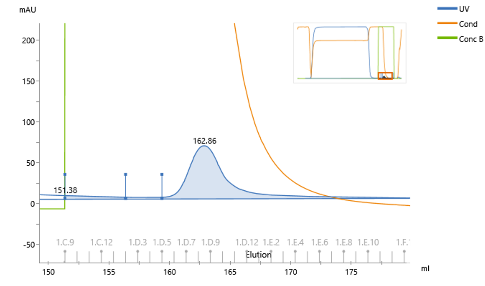
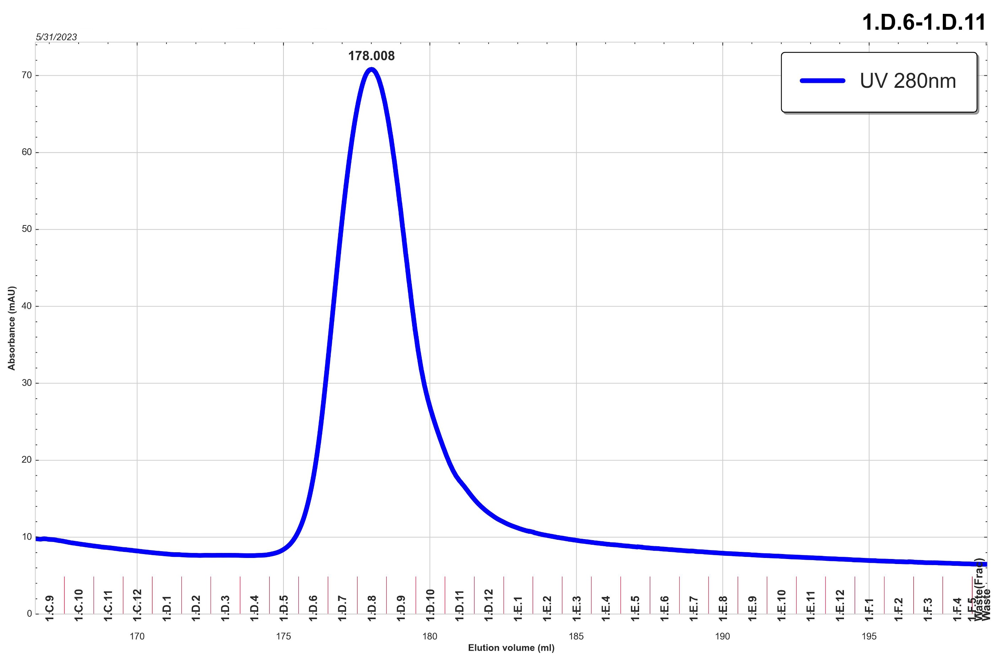
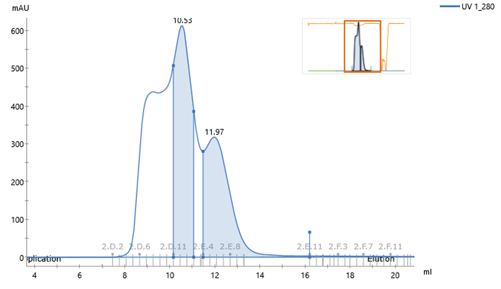
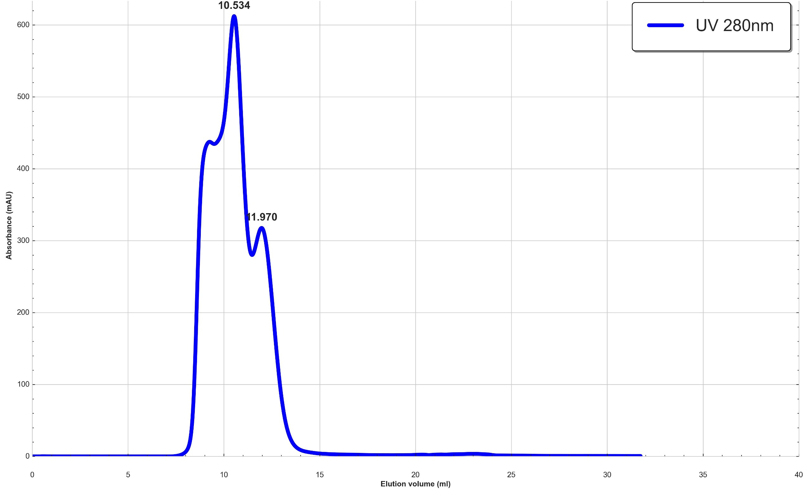

# **Project AKTAmercy - "CHROMER"**

[] |
[] |
[]

CHROMER is a Python automaton that post-processes chromatographic data from AKTA Pure HPLC systems running UNICORN (7.0+). It compiles `.UFol` and `.Result` files into annotated JPG chromatograms locally.

## Features

- **PyCORN-powered Parsing**: Parses proprietary `.UFol` (*UNICORNS*) archives from UNICORN Evaluation software, using a PyCORN-inspired parser by [Yasar L. Ahmed](https://github.com/pyahmed)
- **Chromatogram Recognition**: Recognizes and annotates chromatograms with sample name, purification method, and date using a local construct index (`brain.json`)
- **Peak Detection**: Detects peaks in the chromatogram and determines pool fractions based on peak area
- **Local Output**: Writes compiled chromatograms to timestamped folders under `./data/DONE/`

## Developmental Roadmap

<details>
<summary>
<b> 1.0.0 </b> :white_check_mark: 
</summary> 

```diff
Advancements
+ SEC Chromatograms generated are now numerically accurate, accounting for flow rate and injection point.
+ Index algorithm now covers a majority of targets
+ Debug tools <b>?INSPECT</b> and <b>parseLOG</b> added to identify deviants easily.
+ CHROMER -> CHROMER

Regressions
- Multiprocessing removed for simplicity, potential for reimplementation at later release
- AFFINITY chromatograms are visually congruent, but numerically (x values / volume) incorrect.
```
</details>

## Known Issues and Limitations

- **Chromatogram Recognition**: The recognition algorithm relies on a local index (`brain.json`). Each purification target is identified by a batch number entered into the `Sample_ID` field prior to purification.
- **Duplicate Logging**: Even without multiprocessing, the log generates duplicate lines for each sample. `parseLOG` is required to process logs when looking for deviants.
- **Pooling Fractions (AFFINITY)**: The implementation is incomplete, and lacks the ability to enumerate multiple peaks. Some of the pooling ranges are a bit too conservative.
- **Plotting**: Revisions to the plotting are likely, to include more information and to make the plots more readable.

Please report any issues you encounter [here](https://github.com/alxdolphin/AKTAmercy/issues), and feel free to contribute to the project by submitting a [pull request](https://github.com/alxdolphin/AKTAmercy/pulls).

## Usage

To use CHROMER, you need Python installed on your system. A virtual environment via [Anaconda](https://www.anaconda.com/) or [Miniconda](https://docs.conda.io/en/latest/miniconda.html) is recommended.

```bash
# Create and activate the environment
conda env create -f environment.yml
conda activate CHROMER

# Clone the repository
git clone https://github.com/alxdolphin/AKTAmercy.git
cd AKTAmercy

# Place UNICORN files in the drop-off directory
mkdir -p ./data/DROP-OFF

# Run the script
./CHROMER.py
```

The script processes all `.UFol` and `.Result` files in `./data/DROP-OFF/` and writes compiled chromatograms to `./data/DONE/<timestamp>/`, organized by purification method.

## Construct Index (`brain.json`)

CHROMER maps batch numbers to construct metadata via `./brain.json`. Each entry uses the batch number (uppercase) as the key:

```json
{
    "BATCH01": {
        "ConstructID": "MyConstruct_pVax",
        "Ext/1000": "210",
        "MW/1000": "150.00"
    }
}
```

| Field | Description |
| --- | --- |
| `ConstructID` | Construct name used in chromatogram titles |
| `Ext/1000` | Extinction coefficient (×1000) |
| `MW/1000` | Molecular weight (×1000) |
| `TargetClass` | Optional. When set to `IgG` or `Fc`, Protein A runs use stronger capture-pool wording. When set to `glycoprotein`, Lectin runs use glycoprotein-pool wording. Omit to keep cautious candidate-fraction labels. |

Maintain `brain.json` manually or export from your lab's tracking system. CHROMER loads this file at startup and does not fetch remote updates.

## Chromatogram Annotations

CHROMER separates UV280 signal detection from biological interpretation on each plot:

1. **Signal** — peak volume/absorbance markers and, for Protein A / Lectin runs, candidate elution fraction ranges derived from peak width.
2. **Interpretation** — a method-specific summary line in the top-right corner.

Default summary labels are cautious and do not assume target identity unless metadata supports it:

| Method | Summary label (typical) |
| --- | --- |
| Protein A | `Candidate Protein A elution fraction: A1-A2` |
| Lectin | `Candidate lectin-binding fraction: A1-A2` |
| IMAC | `IMAC UV280 peak detected: verify target-containing fractions` |
| SEC | `SEC UV280 peak detected: signal only; verify identity/oligomeric state separately` |
| No peak | `No clear UV280 elution peak` |

Multiple peaks on Protein A / Lectin runs are labeled `MULTI —` with all candidate fraction ranges listed. Protein A runs may upgrade to IgG/Fc capture wording when `TargetClass` is set or when the construct name matches high-confidence IgG/Fc patterns.

## Configuration

`config.json` controls local paths and plotting parameters:

```json
{
    "paths": {
        "unicorns": "./data/DROP-OFF/",
        "run_folder_base": "./data/DONE/",
        "brain": "./brain.json"
    },
    "plotting": { "params": { ... } }
}
```

## State of the Art - UNICORN vs CHROMER

`v1.0.0-rc1`

| | UNICORN | CHROMAUTOGRAM |
|:---:|:---:|:---:|
| **Lectin** | <sub></sub> | <sub></sub> |

<center>
The X values are slightly off in the CHROMAUTOGRAM, but the plot is otherwise identical to the UNICORN plot, with the peak falling within the same fraction range and reaching the same height.
</center>

| | UNICORN | CHROMAUTOGRAM |
|:---:|:---:|:---:|
| **SEC** | <sub></sub> | <sub> </sub> |

<center>
Features like peak area shading, an overview plot, and more are planned in future releases.

## Resources and Acknowledgements

</center>

| Category | Libraries/APIs |
| --- | --- |
| **Data Handling** | [PyCORN](https://github.com/pyahmed/PyCORN) |
| **Python Standard Library** | [datetime](https://docs.python.org/3/library/datetime.html), [io](https://docs.python.org/3/library/io.html), [json](https://docs.python.org/3/library/json.html), [logging](https://docs.python.org/3/library/logging.html), [os](https://docs.python.org/3/library/os.html), [re](https://docs.python.org/3/library/re.html), [struct](https://docs.python.org/3/library/struct.html), [tarfile](https://docs.python.org/3/library/tarfile.html), [xml.etree.ElementTree](https://docs.python.org/3/library/xml.etree.elementtree.html), [collections.OrderedDict](https://docs.python.org/3/library/collections.html#collections.OrderedDict), [zipfile](https://docs.python.org/3/library/zipfile.html) |
| **Data Visualization** | [numpy](https://numpy.org/), [matplotlib](https://matplotlib.org/stable/api/pyplot_summary.html), [mpl_toolkits](https://matplotlib.org/stable/api/artist_api.html), [seaborn](https://seaborn.pydata.org/), [scipy.signal](https://docs.scipy.org/doc/scipy/reference/signal.html) |
